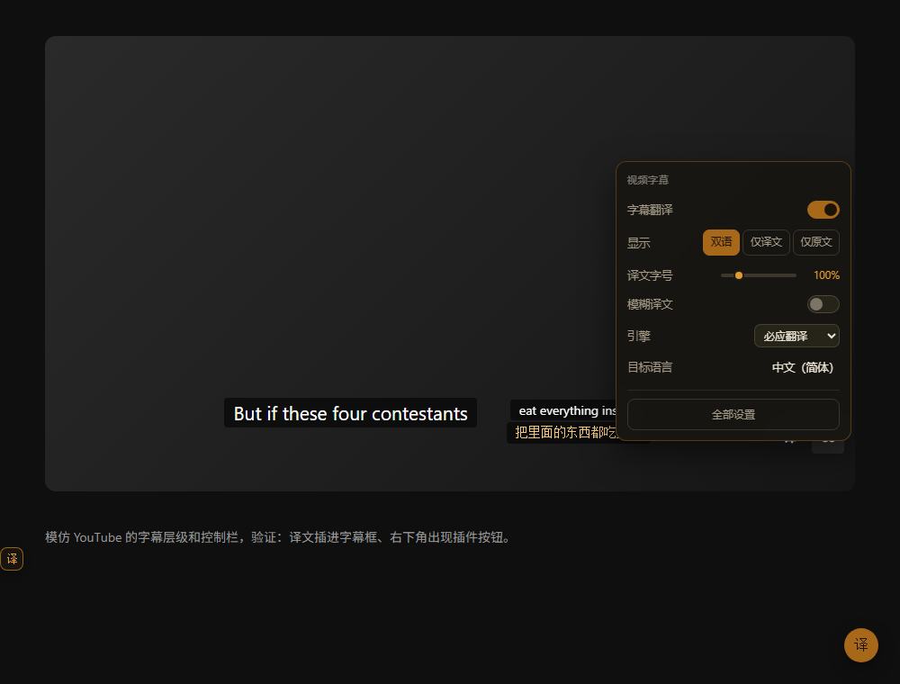
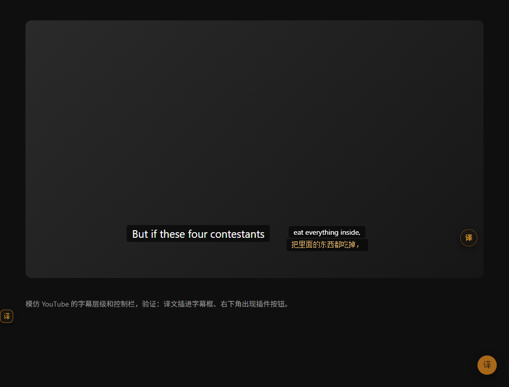

# 拾穗译 · Gleaner


一个面向 Edge / Chrome 的双语对照网页翻译扩展。原文留在原位，译文紧跟其后，读外文页面时不需要在「看懂」和「看准」之间二选一。

Manifest V3 · 无需构建 · 打开即用 · 默认引擎免注册免密钥

---

## 功能

**视频字幕**

YouTube、B 站这类能拿到字幕轨的站点会先取回整条字幕、提前翻好，轮到显示时直接取缓存，没有等待。

播放器右下角有一个「译」按钮，点开就地调整字幕设置（显示方式、字号、模糊、底色、引擎、目标语言）：



控制栏找不到、或者按钮被播放器重建冲掉时，会自动在视频右下角浮一个按钮顶上：



**网页翻译**

- 整页双语对照：智能识别正文区域，以段落为单位插入译文，尽量不破坏原页面排版
- 三种显示模式：双语对照 / 仅译文 / 仅原文，随时切换
- **逐段语言判断**：本来就是目标语言的段落会跳过。目标是中文时中文段落不翻，目标是英文时英文段落不翻，
  中英混排的页面只处理需要翻译的那部分
- 视口优先：先翻你正在看的部分，滚动到哪里补翻到哪里
- 动态内容：SPA、无限滚动、聊天流中新出现的内容会自动补翻
- 翻译过程中可以随时点「停止并还原」，不会有多余译文残留
- 页面标题与描述同步翻译

**页面右下角的入口**

点一下圆形小球，展开控制面板。翻译 / 还原、显示方式、目标语言、翻译引擎、译文字号、导出、设置全在里面。

日常操作不必再去工具栏找扩展图标，这一点在没把图标固定到工具栏时尤其省事。

- 点「目标语言」或「翻译引擎」，会在面板旁边**单独弹出一个浮层**，主面板尺寸保持不变
- 浮层里能直接搜语言、切引擎，选完自动收起
- 面板会**自动判断往左还是往右展开**，球拖到哪一边都不会跑出屏幕
- 翻译过程中球上显示环形进度环和已完成段数，主按钮随时可以「停止并还原」
- 底部「记住本页」：在页面上调好引擎、语言、字号之后点一下，这个网站下次打开自动套用
- 拖动可以换位置，位置会记住

**快捷键**

| 方式 | 操作 |
| --- | --- |
| 翻译 / 还原当前页 | `Alt` + `T` |
| 循环切换显示模式 | `Alt` + `Shift` + `T` |
| 划词翻译 | 选中文字后点浮标（或设为选中即翻） |
| 悬停翻译 | 按住 `Ctrl` 鼠标停在该段落上，松开收起 |
| 输入框翻译 | 任意输入框内连按 3 次空格 |

- 右键菜单：翻译此页 / 还原原文 / 翻译选中文字 / 翻译输入框 / 识别图片文字

**文档与媒体**

- PDF 双语翻译：内置 pdf.js 阅读器，渲染原文并在每页下方给出段落级双语对照
- 图片文字翻译：内置离线 OCR（tesseract.js），识别后翻译，结果面板可复制
- 视频双语字幕：监听主流播放器的字幕层，在视频上方叠加译文

**自定义**

- 译文样式：字号（像素，0 表示跟随原文）、不透明度、行高、左右缩进、最大宽度（像素）、段间距、分割线样式、字体（含宋体）
- 配色方案三选：琥珀细线 + 淡琥珀译文（默认，自动适配网页明暗）/ 自定义颜色 / 跟随原文
- **多套大模型配置**：DeepSeek、通义、Kimi、智谱、硅基流动、本地 Ollama 各存一套，随时切换，互不干扰
- 按站点保存独立配置：页面上面板底部的「记住本页」，或弹窗里的「本页设置」都能存取
- 自动翻译规则：按域名（支持 `*.` 通配）或按页面语言
- 术语表：自定义词条强制替换，对大模型引擎同时作为提示词下发
- **界面配色**：琥珀 / 青竹 / 靛青 / 玫红 / 墨灰五种强调色，深浅两套主题各自适配，设置页左下角一点即换
- **视频字幕独立设置**：字幕开关、显示方式、模糊译文、字幕底色（实底 / 半透明 / 透明）、
  译文字号、距视频底部的位置；播放器右下角的「译」按钮可以就地调整
- 所有下拉框和滑块都是自定义控件，数值可以直接输入，不出现浏览器默认样式

**语言**

138 种语言互译，覆盖微软翻译官方语言表全部语种，包含简体中文、繁体中文、粤语、文言文等。

---

## 翻译引擎

引擎可插拔，弹窗内随时切换。

| 引擎 | 需要配置 | 说明 |
| --- | --- | --- |
| **必应翻译**（默认） | 否 | 免注册免密钥，国内可直连，走 LLM 模式质量较好 |
| 微软翻译（官方 API） | Azure Key | F0 免费层每月 200 万字符，最稳定的官方通道 |
| 谷歌翻译 | 否 | 免密钥，国内需要浏览器走代理 |
| 大模型（OpenAI 兼容） | Base URL + Key | DeepSeek / 通义 / Kimi / 智谱 / 硅基流动 / OpenRouter / 本地 Ollama |
| MyMemory | 否 | 备用免费通道，单段长度有限，质量一般 |
| 浏览器内置（离线） | 否 | 完全离线，需要 Chrome 138+ / Edge 148+，受地区与硬件限制 |

> 说明：免配置通道走的是各家面向网页端公开的接口，适合个人自用，不保证长期稳定。需要长期稳定请配置大模型或官方 API。

---

## 安装

1. 打开 `edge://extensions`（Chrome 为 `chrome://extensions`）
2. 打开左下角「开发人员模式」
3. 点「加载解压缩的扩展」，选择本项目根目录（含 `manifest.json` 的那一层）
4. 建议顺手把图标固定到工具栏：点浏览器右上角的拼图图标，找到「拾穗译」，点它右侧的图钉。
   不固定也完全能用，页面右下角的小球就是完整入口

翻译 PDF 需要额外一步：在扩展详情页打开「允许访问文件 URL」。

---

## 使用

打开任意外文网页，点右下角悬浮球或按 `Alt` + `T`。首次翻译会先出骨架屏占位，随后逐段填入译文。

想换引擎、改目标语言或调译文样式，点工具栏图标打开弹窗；完整设置（引擎密钥、术语表、自动翻译规则、缓存管理、按站点配置）在设置页里。

在链接后面加上 `?amber=auto` 可以让该页面打开时自动翻译，方便做演示页或分享。

---

## 开发

项目**没有任何构建步骤**，源码即成品：

1. 打开 `edge://extensions` / `chrome://extensions`，开启「开发者模式」
2. 点「加载已解压的扩展程序」，选择仓库根目录（含 `manifest.json` 的那一层）
3. 改完代码在扩展管理页点「刷新」生效；已打开的网页按 `F5` 重新加载

内置测试页：

```bash
cd test
node server.js 8791
```

| 页面 | 用途 |
| --- | --- |
| `sample.html` | 英文长文，验证整页双语 |
| `mixed.html` | 中英混排，验证逐段语言判断 |
| `lang.html` | 中英法德日俄六语，验证跟随目标语言跳过 |
| `subtitle.html` | 模拟 YouTube 的字幕层级与控制栏 |
| `ocr.html` | 图片文字翻译 |
| `interact.html` | 划词 / 悬停 / 输入框 |
| `pdf-sample.pdf` | PDF 双语对照 |

完整的约定与自查清单见 [CONTRIBUTING.md](CONTRIBUTING.md)。

---

## 目录结构

```
gleaner/
├─ manifest.json          扩展清单（MV3）
├─ background.js          服务工作线程：翻译调度、缓存、快捷键、右键菜单、PDF 接管、离屏 OCR
├─ offscreen.html/js      OCR 离屏文档
├─ engines/               引擎适配器（bing / microsoft / google / openai / mymemory / builtin）
├─ common/                语言库、配置读写、IndexedDB 缓存、消息常量、通用 UI 控件、工具函数
├─ content/               内容脚本
│   ├─ extract.js         段落提取（块级聚合、跳过代码区）
│   ├─ inject.js          译文注入、显示模式、样式变量、配色预设
│   ├─ fab.js             悬浮球
│   ├─ bubble.js          划词气泡
│   ├─ hover.js           悬停翻译
│   ├─ input.js           输入框翻译
│   ├─ observer.js        动态内容补翻
│   ├─ subtitle.js        视频字幕（按时间轴渲染 + 预翻译）
│   ├─ track-hook.js      页面世界脚本：嗅探字幕轨（YouTube / B 站）
│   ├─ ocr.js             图片翻译面板
│   └─ main.js            流程编排
├─ popup/                 工具栏弹窗
├─ options/               设置页
├─ pdf/                   PDF 双语阅读器
├─ icons/                 扩展图标
├─ lib/                   第三方运行库与生成脚本
│   ├─ pdfjs/             pdf.js
│   ├─ tesseract/         tesseract.js 与英文语言包
│   ├─ make_icons.py      图标生成脚本
│   └─ gen_langs.py       语言库生成脚本
├─ docs/screenshots/      README 配图
├─ test/                  本地测试页与样本 PDF
└─ .github/               Issue 模板
```

---

## 实现要点

- **段落聚合**：`TreeWalker` 遍历文本节点，向上归并到最近的块级容器，避免把一句话拆成多个请求。`pre`、`code`、输入框、`contenteditable` 默认跳过。
- **样式隔离**：译文节点用独立类名加高特异性规则，译文被页面样式污染的概率很低；悬浮球、气泡、OCR 面板使用 Shadow DOM 完全隔离。
- **速度**：`IntersectionObserver` 实现视口优先；请求池并发；结果按「引擎 + 语言对 + 原文哈希」写入 IndexedDB，同一内容第二次出现直接命中缓存。
- **稳妥**：失败自动重试并降级显示可点击的重试提示；单个批次失败不影响其他段落；批量接口不可用时自动退化为逐条翻译。

---

## 隐私

- 翻译请求只发往你选择的引擎，扩展本身不收集任何数据，也没有任何统计上报。
- API Key 保存在浏览器本地存储中，不会上传到第三方。
- 图片 OCR 完全在本地离屏文档中运行，图片不会离开你的设备。

---

## 已知限制

- 免配置通道依赖第三方公开接口，可能因对方调整而失效，届时切换到官方 API 或大模型即可。
- 复杂版式的网页（多层嵌套、表格套表格）译文位置可能不理想。
- PDF 译文以「每页下方段落对照」的形式呈现，不重排原文档；扫描件 PDF 需要先有文本层（可先用图片 OCR 功能）。
- OCR 默认只打包了英文语言包，识别其他语种会按需从 CDN 下载。
- 视频字幕依赖播放器的字幕层，需要先打开该网站的字幕。

---

## 第三方组件

- [pdf.js](https://github.com/mozilla/pdf.js) — Apache-2.0
- [tesseract.js](https://github.com/naptha/tesseract.js) — Apache-2.0
- [tesseract.js-core](https://github.com/naptha/tesseract.js-core) — Apache-2.0

---

## 参与贡献

欢迎提 Issue 和 PR。动手前建议先读 [CONTRIBUTING.md](CONTRIBUTING.md)，
里面写了本地运行方式、测试页清单、代码约定和提交前自查项。

- 问题反馈：[bug_report.md](.github/ISSUE_TEMPLATE/bug_report.md)
- 功能建议：[feature_request.md](.github/ISSUE_TEMPLATE/feature_request.md)
- 安全问题：请按 [SECURITY.md](SECURITY.md) 私下报告，不要公开提 Issue
- 社区约定：[CODE_OF_CONDUCT.md](CODE_OF_CONDUCT.md)

## 许可

[MIT](LICENSE) © daidairui103514
